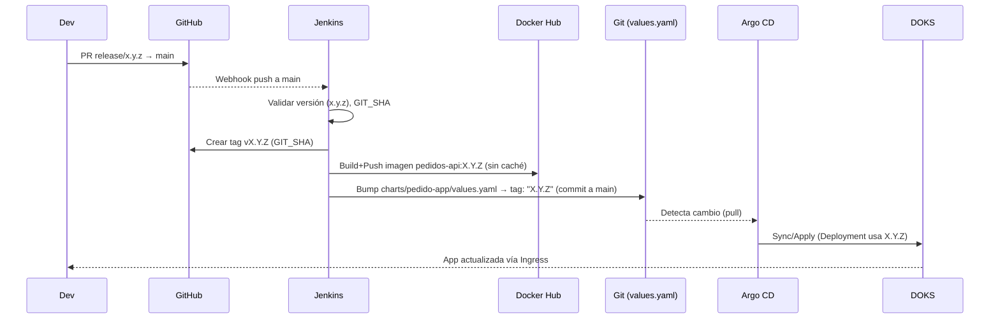

# pedido-app — Documentación de arquitectura, CI/CD y operación

Este repositorio implementa un servicio de pedidos con una cadena CI/CD GitOps completa sobre Kubernetes en DigitalOcean.

- Backend (`backend/`): Spring Boot 3/Java 21, empaquetado como contenedor.
- Infraestructura como manifiestos Helm (`charts/pedido-app/`).
- Pipeline CI/CD declarativo (`jenkins/Jenkinsfile`) ejecutándose en Kubernetes con Kaniko.
- GitOps con Argo CD apuntando a `main` y `charts/pedido-app`.

La política de versionado es estrictamente SemVer (x.y.z). No se usan etiquetas mutables como `latest` en despliegues ni en CI.

---

## Arquitectura (alto nivel)

```mermaid
flowchart LR
  Dev[Desarrollador] -->|push/PR| GitHub
  subgraph CI/CD
    GitHub -->|webhook push a main| Jenkins
    Jenkins -->|build kaniko (x.y.z)| DockerHub[(Docker Hub)]
    Jenkins -->|bump values.yaml (x.y.z)| Repo[(Repo GitHub)]
    Repo -->|watch main/path| ArgoCD
  end
  ArgoCD -->|sync| DO[Kubernetes DigitalOcean]
  DO -->|Servicio/Ingress| Usuario[Cliente HTTP]
```

---

## Infraestructura en DigitalOcean

- Kubernetes (DOKS) con al menos:
  - Node pool de trabajo (labels usado por Jenkins agent): `doks.digitalocean.com/node-pool: pool-9x07hzzwz`.
  - NGINX Ingress Controller para exponer HTTP.
  - StorageClass `do-block-storage` para volúmenes (PostgreSQL statefulset si se habilita).
- Namespaces típicos:
  - `pedido-app`: backend y base de datos.
  - `argocd`: controlador GitOps.
  - `jenkins`: controller y agentes (podTemplate) del pipeline.
- Exposición:
  - Ingress: host `24.199.78.153.nip.io`, path base `/api` → Service `pedido-app-pedido-app:8080`.

---

## Backend (`backend/`)

- Framework: Spring Boot 3.3 / Java 21 (Temurin).
- Empaquetado: Gradle Wrapper y Docker multi-stage (`backend/Dockerfile`).
- Endpoints principales en `com.mobiapp.pedidos.controller.PedidoController`:
  - `POST /api/pedidos` crear pedido.
  - `GET /api/pedidos/{id}` obtener por id.
  - `PATCH /api/pedidos/{id}/estado` actualizar estado.
  - `GET /api/pedidos` listar pedidos.
- Manejo de errores: `GlobalExceptionHandler` (404 para recursos inexistentes, 400 validaciones, etc.).

Build local rápido:

```bash
./gradlew :backend:bootJar
java -jar backend/build/libs/*-SNAPSHOT.jar
```

Contenedor local:

```bash
docker build -f backend/Dockerfile -t ivan150/pedidos-api:dev .
docker run -p 8080:8080 ivan150/pedidos-api:dev
```

---

## Helm chart (`charts/pedido-app/`)

- `values.yaml` controla:
  - `image.repository` y `image.tag` (siempre una SemVer entre comillas: `"1.2.3"`).
  - `ingress.hosts[].host` y `paths` (por defecto `/api`).
  - `resources`, `replicaCount` y `hpa`.
  - `db.enabled` para incluir PostgreSQL en el mismo release.

Despliegue manual (si se requiere fuera de GitOps):

```bash
helm upgrade --install pedido-app charts/pedido-app -n pedido-app --create-namespace
```

---

## CI/CD — Jenkins + Kaniko + Argo CD

El pipeline está en `jenkins/Jenkinsfile` y corre en un agente Kubernetes con dos contenedores: `git` y `kaniko`.

### Stages relevantes

- **Validar versión**
  - Deriva `APP_VERSION` (SemVer) desde el merge `release/x.y.z` → `main` o desde el parámetro.
  - Captura `GIT_SHA` del commit: `git rev-parse HEAD`.
- **Crear tag Git del release**
  - Crea y empuja el tag anotado `v${APP_VERSION}` apuntando a `GIT_SHA`.
- **Configurar credenciales Docker para Kaniko**
  - Autenticación a Docker Hub vía `usernamePassword` (secreta en Jenkins).
- **Build & Push (Kaniko)**
  - Build sin caché: `--cache=false --reproducible`.
  - Pasa metadata de build a Dockerfile: `--build-arg GIT_SHA` y `--build-arg APP_VERSION`.
  - Publica `ivan150/pedidos-api:${APP_VERSION}`.
- **Bump image.tag en Helm values**
  - Actualiza `charts/pedido-app/values.yaml` → `tag: "${APP_VERSION}"` y commitea a `main`.
- **Commit & Push**
  - Empuja el cambio de `values.yaml` a GitHub.

### Dockerfile con metadata de build

`backend/Dockerfile` añade LABELs OCI para verificar qué commit/versión corre:

```dockerfile
ARG GIT_SHA="unknown"
ARG APP_VERSION="unknown"
LABEL org.opencontainers.image.revision=$GIT_SHA \
      org.opencontainers.image.version=$APP_VERSION
```

### Flujo CI/CD (detallado)



---

## Trazabilidad: comprobar que la imagen corresponde al commit

- Inspección local (Docker):

```bash
docker pull ivan150/pedidos-api:X.Y.Z
docker image inspect ivan150/pedidos-api:X.Y.Z | jq '.[0].Config.Labels'
# org.opencontainers.image.version = X.Y.Z
# org.opencontainers.image.revision = <GIT_SHA>
```

- Sin Docker (skopeo):

```bash
skopeo inspect docker://ivan150/pedidos-api:X.Y.Z | jq '.Labels'
```

- En clúster (confirmar tag activo):

```bash
kubectl -n pedido-app describe deploy pedido-app-pedido-app | grep -n "Image:"
```

---

## Operación y endpoints

- URL base pública (Ingress): `http://24.199.78.153.nip.io/api`.
- Ejemplos:

```bash
# Crear
curl -i -X POST http://24.199.78.153.nip.io/api/pedidos \
  -H "Content-Type: application/json" \
  -d '{"descripcion":"prueba"}'

# Listar
curl -i http://24.199.78.153.nip.io/api/pedidos

# Obtener por id
curl -i http://24.199.78.153.nip.io/api/pedidos/<id>

# Actualizar estado
curl -i -X PATCH http://24.199.78.153.nip.io/api/pedidos/<id>/estado \
  -H "Content-Type: application/json" \
  -d '{"estado":"EN_PROCESO"}'
```

---

## Troubleshooting

- **Build publica imagen pero el pod no refleja cambios**
  - Verifica tag activo en Deployment: `kubectl -n pedido-app describe deploy ... | grep Image:`
  - Inspecciona labels de la imagen `org.opencontainers.image.revision` vs commit esperado.
  - Asegura release SemVer nuevo por cada cambio; no reutilizar tags existentes.
  - Confirmar que Argo CD App está `Synced/Healthy` y apunta a `main` + `charts/pedido-app`.

- **Webhook llega pero Jenkins no dispara**
  - En el Job: trigger “GitHub hook trigger for GITScm polling”, Branch `*/main`.
  - `GitHub Hook Log` debe mostrar recepción y polling.

- **Evitar bucles**
  - `Excluded Regions`: `^charts/pedido-app/values.yaml$` para que el bump no re-dispare builds.

---

## Convenciones y políticas

- Versionado: sólo SemVer (`x.y.z`). Prohibido `latest`.
- Un release = una imagen + un tag Git (`vX.Y.Z`) + un bump en Helm.
- Cambios funcionales siempre deben producir un SemVer nuevo.

---

## Comandos útiles

- **Imagen activa**: `kubectl -n pedido-app describe deploy pedido-app-pedido-app | grep -n "Image:"`
- **Pods/Servicios**: `kubectl -n pedido-app get deploy,pods,svc`
- **Logs backend**: `kubectl -n pedido-app logs deploy/pedido-app-pedido-app -f`
- **Argo CD App**: `kubectl -n argocd get application pedido-app -o yaml | grep -E "repoURL|targetRevision|path|status:" -n`

---

## Estructura del repositorio

```text
backend/
  Dockerfile
  build.gradle
  src/main/java/com/mobiapp/pedidos/...
charts/
  pedido-app/
    Chart.yaml
    values.yaml
jenkins/
  Jenkinsfile
```

---

## Roadmap (ideas)

- Probar/añadir `/actuator/info` exponiendo `build.version` y `git.commit`.
- Añadir probes HTTP en el Deployment.
- Tests de contrato y smoke tests post-deploy.